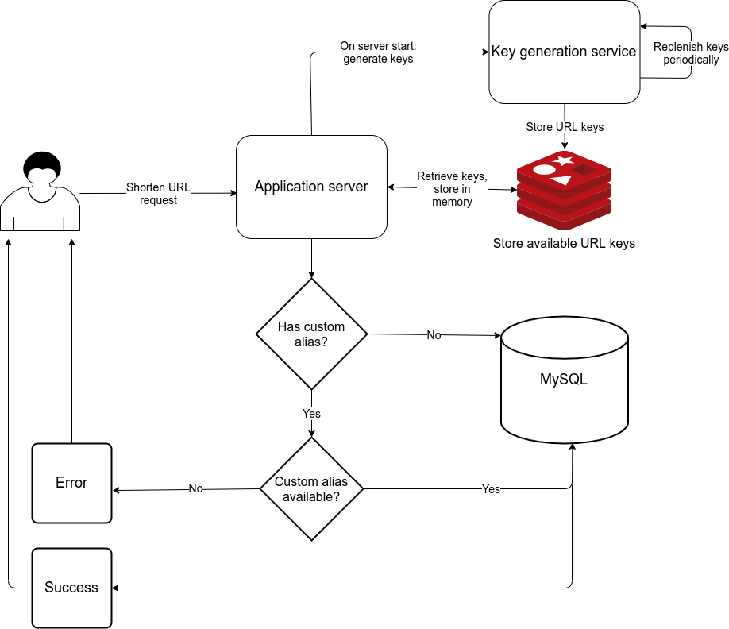
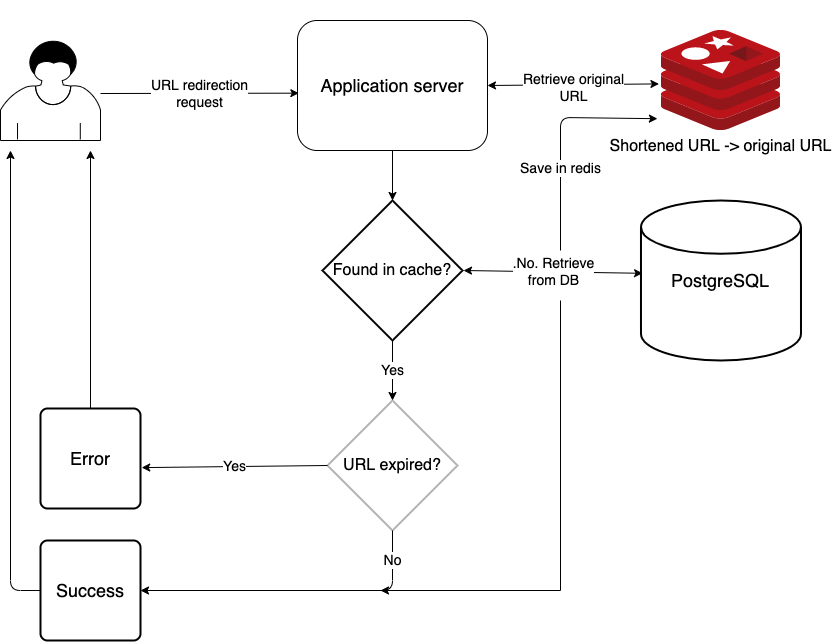

# Introduction

This project is a URL shortener service that allows users to create a short version of a URL.  
Some examples are [bit.ly](https://bitly.com/) and [tinyurl.com](https://tinyurl.com/)

# Libraries
* Programming language: Typescript
* Environment: Node
* Server framework: Express
* Database: PostgreSQL, Redis
* Query builder: Knex
* ORM: Objection
* Test: Mocha
* Lint: Eslint
* Code formatter: Prettier
* Load test: Locust

# Prerequisites
* Install docker: https://docs.docker.com/get-docker/
* Install docker compose: https://docs.docker.com/compose/install/

# Project structure
* `src/middlewares/`: Express middlewares such as error handler, try-catch function
* `src/config/`: Application level configurations
* `src/db/`: Database config, sql schema, domain model
* `src/routes/`: Express routes
* `src/controllers/`: Route handler logic
* `src/util/`: Utilities
* `src/app`: Express server setup
* `src/server`: Express Server entry point
* `test/`
  * `unit/`: Unit tests
  * `integration`: Integration tests 
* `loadtest/`: Test the performance of the APIs

# Run with docker compose
* Usage: `./docker-compose.sh <command> <environment> [<args>]`
* Create and run containers: `./docker-compose.sh <command> <environment> [<args>]`, e.g. `./docker-compose.sh up dev -d`
* Stop and remove containers: `./docker-compose.sh down dev -d`

# Run without docker compose
* Create `.env` file from `.env.sample`, filling in the missing details
* Install dependencies: `npm install`
* Start server: `npm run debug`

# API
1. Shorten a URL  
`POST /urls`
**Request body**
```js
{
  url: string
  alias?: string
}
```

**Response**  
```js
{
  "payload": string
}
```

2. Redirect shortened URL to original URL  
`GET /:urlKey`

# Functional requirements

## 1. Shorten a url
* Can shorten a URL. The shortened url path should be capped at a certain number of characters, e.g. 8

e.g. https://www.fodors.com/community/travel-tips-and-trip-ideas/should-i-go-for-a-gopro-dslr-or-drone-1140434/ -> https://tinyurl.com/y4cs3s76


* Can shorten a URL with custom alias  
e.g. https://www.fodors.com/community/travel-tips-and-trip-ideas/should-i-go-for-a-gopro-dslr-or-drone-1140434/ -> https://preview.tinyurl.com/goprodslrdrone

## 2. Visit a shortened url
* Visiting a shortened URL with or without custom alias should redirect to the original URL.

# Non-functional requirements
* Each URL can have multiple shortened URLs
* Frequently accessed URLs should be cached
* Set a character limit on custom alias(e.g. 16)
* Links should expire after some time(e.g. 2 years)


**Generate short URL**
We will generate the short url using base62 conversion instead of passing the URL through a hash function.

This solves the issue of hash collision due to truncation of the hash value because it is too long.

However, this means that the same URL will not produce the same hash.

## Capacity estimation
* Read to write volume ratio: 50:1

### Traffic

**URL shortening requests**
* Requests per day: 10M
  * Queries per sec: 10M / (24 hours * 60 * mins * 60 secs) = 115

**URL redirection requests**
* Requests per day: 10M * 50 ratio = 500M
  * Queries per sec: 500M / (24 hours * 60 * mins * 60 secs) = 5787

### Storage
PostgreSQL: Shortened URLs and original URLs  
Redis: Cache shortened URLs and original URLs

URL table
* hash: varchar(16)
* originalUrl: varchar(1024)
* createdAt: datetime
* expireAt: datetime

URLs for 2 years: 10M * 30 days * 12 months * 2 years = 7.2B
Max size of an URL entry in DB: 16 + 1024 + 8 + 8 = 1048 bytes
Storage: 7.2B * 1048 bytes per URL = 7.545TB

**Encoding of URL**
Generate a cryptographically strong pseudo random data, encode it with base62.
A 6 character key will result in 62^6 = 56.8 billion possible strings
A 7 character key will result in 62^7 = 3.52 trillion possible strings

**Memory**
Let's assume 10% of the URLs are accessed frequently and will be cached.  
Max usage: 10% * 2.4B URLs * (16 bytes hash + 1024 bytes original url) = 249.6GB

# Architecture

## Write request


## Read request


## Key generation
Generates a certain number of random keys.  
Each key contains 6 characters.  

# Load test
* Install locust: `pip3 install locust`
* Run load test: `locust -f loadtest/locustfile.py`

# Ideas
* Horizontal scaling: application, database and cache servers
* Generate keys up front and periodically instead of on demand
* Analytics: Track the usage of URLs
  * How many redirects per day
  * Remove URL after certain period of inactivity(no redirection request)
* Rate limit: Set a limit on the number of URLs that can be shortened in a specified time frame
* Check URL: Check where a shortened URL redirects to

# TODO
* URL shortening: Check if URL is stored in the database. If it is, return the short url
* Key generation: do not check against the database for existing short urls because there can still be a conflict due to concurrency. Let the database handle the conflict
* Handle expired keys
* Collect metric
* Centralised log collection
* Health check: app, database
* container image scan